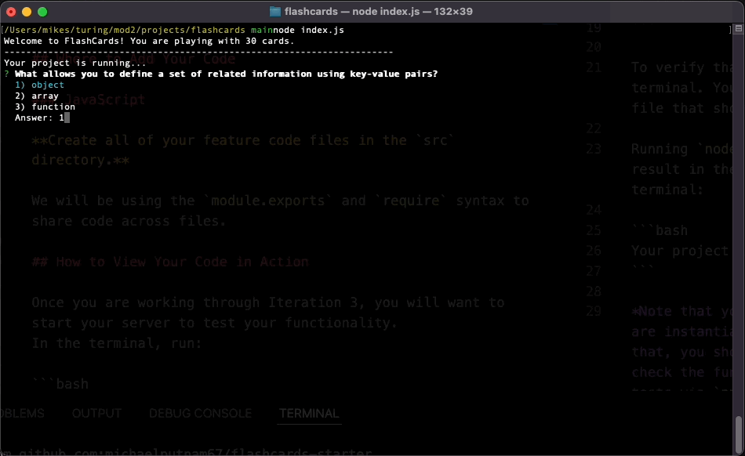

# FlashCards

## Abstract
- The flashcards console app is a set of flashcards a student learning about prototype methods can use to test their knowledge. Users are supplied with 30 default flashcards that are set up with multiple choice or true/false questions. At the end of the deck the game will return the users score and end automatically. 

## GIF

## Technologies Used
- IDE: Visual Studio Code
- GIPHY CAPTURE
- GIT
- GitHub
- Zoom
- Terminal
- MacOS

## Setup

- clone down the repo
- navigate to root directory
- run npm install 
- run node index.js

